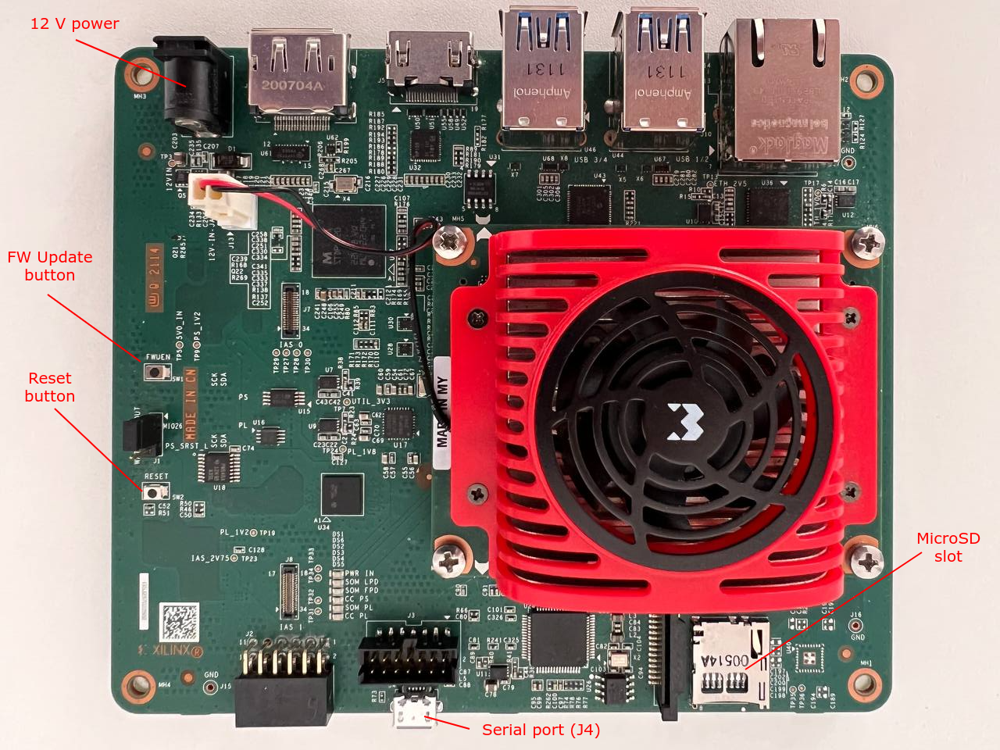

.. _ref-rm_boards_kv260:

Kria KV260 Vision AI Starter Kit
===================================================

.. include:: generic-prepare.rst

Hardware Preparation
--------------------

|Image of Kria board|

#. Ensure that the power code is disconnected.

#. Connect the Micro-USB cable to the ``J4`` connector for serial console
   output.

Flashing and Boot
-----------------

Flashing an SD Card
~~~~~~~~~~~~~~~~~~~

.. note:: Device names and IDs can slightly differ from the steps below.

.. include:: generic-flashing.rst

Flashing QSPI Boot Images
~~~~~~~~~~~~~~~~~~~~~~~~~

The SoM Starter Kits use a two stage boot process:

- The primary boot firmware is pre-installed at the factory on the QSPI device.

- The secondary boot device is an SD card containing the Linux kernel and
  system root.

The Xilinx Starter Kit carrier card hardware design sets and factory-locks
the MPSoC boot mode to QSPI32. The SoM boots up to U-Boot using the QSPI
contents and U-Boot then does a hand-off to the secondary boot device.
To replace the boot image on QSPI device with LmP boot images, they have to be
manually flashed to QSPI using pre-installed U-Boot bootloader shell, which
will be automatically booted on the first boot:
::

    > sf probe; setenv bootseq 1; mmc dev ${bootseq};
    > fatload mmc ${bootseq}:1 ${loadaddr} boot0001.bin;
    > sf update ${loadaddr} 0x200000 ${filesize};
    > sf update ${loadaddr} 0xF80000 ${filesize};
    > fatload mmc ${bootseq}:1 ${loadaddr} u-boot0001.itb;
    > sf update ${loadaddr} 0x300000 ${filesize};
    > sf update ${loadaddr} 0x1080000 ${filesize};
    > reset

After reboot, LmP U-Boot serial output is shown:

::

    U-Boot SPL 2022.01+xlnx+g37fad64d18 (Apr 19 2022 - 15:29:09 +0000)
    PMUFW:	v1.1
    Loading new PMUFW cfg obj (2200 bytes)
    Silicon version:	3
    EL Level:	EL3
    Multiboot:	1
    Trying to boot from MMC2
    SPL: Booting u-boot0001.itb
    ## Checking hash(es) for config config-1 ... OK
    ## Checking hash(es) for Image atf ... sha256+ OK
    ## Checking hash(es) for Image uboot ... sha256+ OK
    ## Checking hash(es) for Image ubootfdt ... sha256+ OK
    ## Checking hash(es) for Image optee ... sha256+ OK
    ## Checking hash(es) for Image fpga ... sha256+ OK

    U-Boot 2022.01+xlnx+g37fad64d18 (Apr 19 2022 - 15:29:09 +0000)

Recovery
--------

If boot images are eventually corrupted, Kria KV260 Vision AI Starter Kit
provides a Image Recovery application. The Image Recovery application is a
baremetal application that uses a web-browser-user interface. It is
invoked when the FW-update (``FWUEN``) button is pressed at power-on,
or automatically, when both image A and image B becomes un-bootable.
It can be used to directly update the A/B images and persistent register
states.

Read the `Boot Firmware Image Recovery`_ page for more details on this
application.

.. _Boot Firmware Image Recovery: https://xilinx.github.io/kria-apps-docs/bootfw/build/html/docs/bootfw_image_recovery.html
