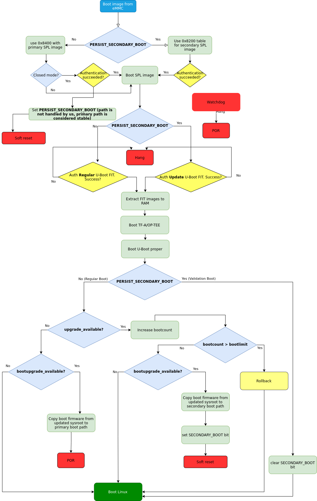
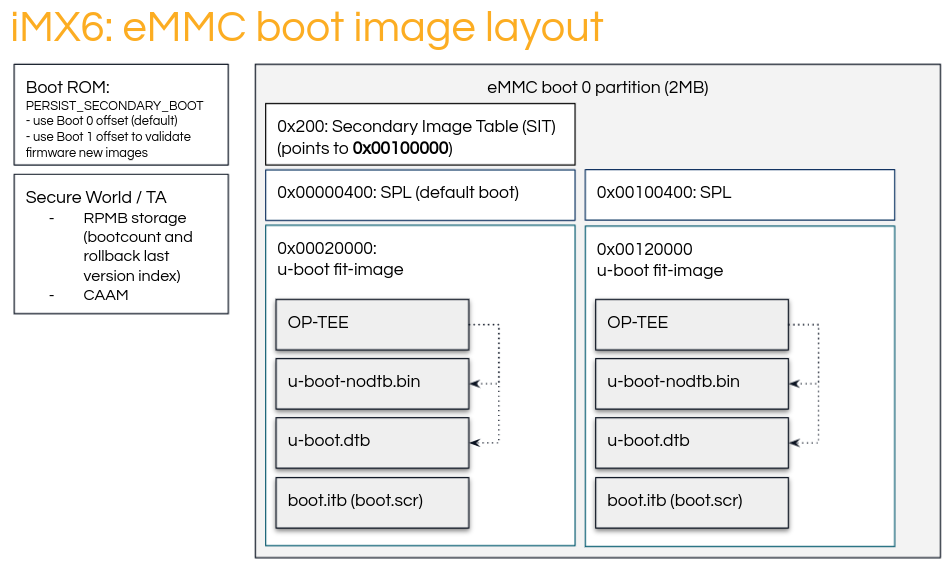

.. highlight:: sh

.. _ref-boot-software-updates-imx:

Boot Software Updates on iMX
============================

Boot Artifacts
--------------

SPL
~~~

SPL is the first software loader generated by the i.MX U-Boot build.
It is signed via the NXP® CST tool, filling in various IVT header fields.
SPL binaries from CI **cannot** be added directly to OTA due to missing signature data, which must be added by you.

In some cases, an SoC may require additional firmware to be loaded (such as DDR firmware for i.MX 8M).
This firmware is loaded prior to the load/verification of U-Boot FIT-image.

U-Boot FIT Image
~~~~~~~~~~~~~~~~

"U-boot FIT-image" is a generic name for the signed FIT-image containing U-Boot proper (``u-boot.bin``) and a host of other firmware.
This file is verified by SPL via a public key stored in SPL’s dtb.
This artifact may be signed—on closed boards—as a part of CI, and can be included automatically in a boot software OTA package.

-  ``U-boot-nodtb.bin``
-  ``U-boot.dtb``
-  OP-TEE
-  Arm Trusted Firmware (ARMv8)
-  Possibly other firmwares

If the CI signing key has been rotated since the last OTA, then the SPL.dtb verification data needs to be updated prior to booting the new U-Boot FIT-image.

MMC Boot Image Layout
---------------------

|image of iMX6 layout| |image of iMX8M layout|

The Secondary Image Table (SIT) is a 20 byte long structure containing 5 32-bit words.
These encode the bootloader B-copy area offset (``firstSectorNumber``), the magic value (``tag``) which is always ``0x00112233``, and three unused words set to ``0``.
Example SIT:

::

    $ hexdump -vC sit-mx8mm.bin
      00000000  00 00 00 00
      00000004  00 00 00 00
      00000008  33 22 11 00 <--- This is the "tag"
      0000000c  00 10 00 00 <--- This is the "firstSectorNumber"
      00000010  00 00 00 00

Boot Flow
---------

SPL
~~~

#.  Initialize DDR
#.  Load U-Boot FIT-image
#.  Perform verification
#.  Extract components
#.  Jump to ATF / OP-TEE

ATF (ARMv8)
~~~~~~~~~~~

#.  Perform memory permission setup
#.  Drop to EL-2 non-secure
#.  Jump to OP-TEE

OP-TEE
~~~~~~

#.  Perform secure world setup
#.  Driver init
#.  Load TAs
#.  Drop to EL-2 secure world
#.  Jump to ``u-boot.bin``

U-Boot
~~~~~~

#.  Driver init
#.  Boot script
#.  Load kernel FIT-image
#.  Perform verification
#.  Extract components
#.  Jump to Linux kernel

Update Procedure
----------------

Primary vs Secondary Boot Paths
~~~~~~~~~~~~~~~~~~~~~~~~~~~~~~~

There are some i.MX SoCs which can be configured to have two copies of the bootloader in SD/eMMC, and switch between them.
The switch can be triggered either by the BootROM—in case the bootloader image is faulty—or can be enforced by the user.

The bootloader A-copy must be placed at a predetermined offset in SD/eMMC.
The bootloader B-copy area offset is determined by an offset stored in The Secondary Image Table (SIT).
The SIT must be placed at the predetermined offset in SD/eMMC.

To enforce BootROM to boot the secondary boot image, ``PERSIST\_SECONDARY\_BOOT`` must be set in the ``SRC\_GPR10`` register, and a warm reset performed.
After reboot, BootROM will boot the image using the offset specified in the SIT table.
For additional details about the SIT format and SIT offsets, please refer to your the SoC Reference Manual, section *Redundant boot support for expansion device*.

``libaktualizr`` and ``aktualizr-lite``
~~~~~~~~~~~~~~~~~~~~~~~~~~~~~~~~~~~~~~~

1. Aktualizr-lite decides if boot firmware needs to be updated based on ``${ostree\_root}/usr/lib/firmware/version.txt``, where ``ostree\_root`` is the root of newly deployed ostree sysroot.
   Example of contents: ``bootfirmware\_version=10``
2. After parsing ``bootfirmware\_version``, it compares the new version number with the existing one.
   This is obtained via ``fiovb`` or ``ubootenv``.
3. If ``bootfirmware\_version`` from ``version.txt`` is higher than the existing one, aktualizr-lite sets ``bootupgrade\_available`` via ``fiovb`` or ``ubootenv``.
4. Reboot should be performed.

U-Boot ``boot.cmd`` Script
~~~~~~~~~~~~~~~~~~~~~~~~~~

   Boot firmware upgrade flow

1. Actual update is done via U-Boot ``boot.cmd`` script (``boot.scr``).
2. ``boot.cmd`` checks if the booting secondary path is booted.
3. In case ``upgrade\_available`` is set, check if boot firmware upgrade is needed is by checking the ``bootupgrade\_available`` flag.
   If both are true, obtain boot firmware images from the newly deployed ostree sysroot and write them to secondary boot path offsets.
   After the secondary boot bit is set, warm reset is performed to enforce BootROM to boot secondary boot path.
4. After executing rebooting secondary boot path, perform condition verification from step 2.
   It should evaluate as false, so regular booting of Linux having taken place.
5. After Linux is booted, aktualizr-lite confirms a successful update by clearing the **upgrade\_available** flag.
   At this point, new boot firmware images are validated and need to be flashed to the stable primary path.
   Additional reboot is needed after this step.
6. Regular POR cold reset is performed.

Add a New Board
---------------

.. _ref-sec-tfa-optee:

TF-A/OP-TEE
~~~~~~~~~~~

TF-A on ARMv8, or OP-TEE on ARMv7, provides PSCI services to the Linux® OS and should support the ``SYSTEM\_RESET2``.
This implements a internal warm reset, resetting only the CPU.
This is needed for retaining the values of special registers after reboot.
This behavior differs from a regular ``SYSTEM\_RESET``, which causes ``POR``, removing power for the whole board (resets CPU, DDR and peripherals, on some boards it also resets external PMIC).

U-Boot
~~~~~~

SPL: FIT Image Offset Calculation
^^^^^^^^^^^^^^^^^^^^^^^^^^^^^^^^^

U-Boot SPL automatically detects which image to boot next based on the SECONDARY\_BOOT value.
Every board has the configuration ``CONFIG\_SYS\_MMCSD\_RAW\_MODE\_U\_BOOT\_SECTOR``.
This contains the offset of the U-Boot FIT image, beginning from the boot media sectors (512 bytes each).
Below is an example of how the final offset is calculated on iMX SoCs (extract from ``./arch/arm/mach-imx/spl.c``):

::

    #if defined(CONFIG_SECONDARY_BOOT_RUNTIME_DETECTION) && \
        defined(CONFIG_SYS_MMCSD_RAW_MODE_U_BOOT_USE_SECTOR)
    unsigned long spl_mmc_get_uboot_raw_sector(struct mmc *mmc,
                                               unsigned long raw_sect)
    {
        int boot_secondary = boot_mode_getprisec();
        unsigned long offset = CONFIG_SYS_MMCSD_RAW_MODE_U_BOOT_SECTOR;

        if (boot_secondary) {
                offset += CONFIG_SECONDARY_BOOT_SECTOR_OFFSET;
                printf("SPL: Booting secondary boot path: using 0x%lx offset "
                       "for next boot image\n", offset);
        } else {
                printf("SPL: Booting primary boot path: using 0x%lx offset "
                       "for next boot image\n", offset);
        }

        return offset;
    }
    #endif

Fastboot: Support of Secondary Boot Image Offsets
^^^^^^^^^^^^^^^^^^^^^^^^^^^^^^^^^^^^^^^^^^^^^^^^^

The required offsets for the secondary boot images (**SPL**, **U-Boot.itb**, and **SIT**) for iMX6, iMX6ULL, iMX7, and iMX8M SoCs are defined by the FSL fastboot driver.
To change the SIT offset used for an SoC,
adjust the ``secondary\_image\_table\_mmc\_offset()`` and ``bootloader\_mmc\_offset()`` functions within the U-Boot fastboot driver source (``drivers/fastboot/fb\_fsl/fb\_fsl\_partitions.c``).

Secondary Image Table Generation
^^^^^^^^^^^^^^^^^^^^^^^^^^^^^^^^

SIT image binary is generated automatically if U-Boot is being built with the correct value for the ``CONFIG\_SECONDARY\_BOOT\_SECTOR\_OFFSET`` config option.

Watchdog
^^^^^^^^

The secondary boot path is mainly used for boot firmware update image validation.
In exceptional cases it will behave incorrectly, such as the system not responding.
To address such cases, watchdog support has to be enabled in SPL.
This is done by adding the following config options to ``lmp.cfg``:

::

    CONFIG_IMX_WATCHDOG=y
    CONFIG_SPL_HW_WATCHDOG=y
    # CONFIG_SPL_WDT is not set
    CONFIG_SPL_WATCHDOG_SUPPORT=y

``meta-lmp``
~~~~~~~~~~~~

MfgTool Scripts
^^^^^^^^^^^^^^^

To deploy boot images to the destination board, the :term:`mfgtools` package is used.
It uses a special configuration file with ``uuu`` extensions, which contains all instructions needed for the deployment of boot images.
Default :term:`uuu` files do not support flashing images for secondary boot path.
Doing so requires the following adjustments: adding SIT image, secondary SPL, and U-Boot FIT deployment steps:

::

    +FB: flash bootloader_s ../imx-boot-@@MACHINE@@
    +FB: flash bootloader2_s ../u-boot-@@MACHINE@@.itb
    +FB: flash sit ../sit-@@MACHINE@@.bin

The final uuu script looks like:

::

    uuu_version 1.2.39
    SDP: boot -f imx-boot-mfgtool
    SDPS: boot -f imx-boot-mfgtool

    SDPV: delay 1000
    SDPV: write -f u-boot-mfgtool.itb
    SDPV: jump

    FB: ucmd setenv fastboot_dev mmc
    FB: ucmd setenv mmcdev ${emmc_dev}
    FB: ucmd mmc dev ${mmcdev} 1; mmc erase 0 0x2000
    FB: flash bootloader ../imx-boot-@@MACHINE@@
    FB: flash bootloader2 ../u-boot-@@MACHINE@@.itb
    FB: flash bootloader_s ../imx-boot-@@MACHINE@@
    FB: flash bootloader2_s ../u-boot-@@MACHINE@@.itb
    FB: flash sit ../sit-@@MACHINE@@.bin
    FB: ucmd if env exists emmc_ack; then ; else setenv emmc_ack 0; fi;
    FB: ucmd mmc partconf ${mmcdev} ${emmc_ack} 1 0
    FB: done

``lmp.cfg`` Files
^^^^^^^^^^^^^^^^^

To enable support for flashing/booting secondary boot images, adjust both the default ``lmp.cfg``, and the one for mfgtools.
The following config options need to be added to the default ``lmp.cfg``:

::

    CONFIG_SECONDARY_BOOT_RUNTIME_DETECTION=y
    CONFIG_SECONDARY_BOOT_SECTOR_OFFSET=0x1000
    CONFIG_CMD_SECONDARY_BOOT=y

And to mfgtool ``lmp.cfg``:

::

    CONFIG_FSL_FASTBOOT_BOOTLOADER_SECONDARY=y
    CONFIG_SECONDARY_BOOT_SECTOR_OFFSET=0x1000

Pre-Load ``boot.cmd`` by SPL
^^^^^^^^^^^^^^^^^^^^^^^^^^^^

As ``boot.cmd`` depends on U-Boot commands for booting Linux, it should be aligned with the U-Boot version.
By default, in setups without boot firmware update support, ``boot.cmd`` is stored in the first FAT partition in eMMC/SD.
To get ``boot.cmd`` updates—together with other boot software images—it should be moved from the FAT partition, to the U-Boot FIT image.
To do this, edit ``lmp-machine-custom.inc``, adding this line for your board (imx8mqevk used as an example):

::

    BOOTSCR_LOAD_ADDR_imx8mqevk = "0x44800000"

This change will include Linux ``boot.cmd`` into the U-Boot FIT image, alongside TF-A/OP-TEE/U-Boot proper/U-Boot dtb images.
When SPL parses the U-Boot FIT image (``u-boot.itb``) it will pre-load ``boot.itb`` (compiled and wrapped ``boot.cmd``) to the address specified in ``BOOTSCR\_LOAD\_ADDR`` variable.

To let U-Boot know where to get the boot script from, you should also adjust ``CONFIG\_BOOTCOMMAND`` in the U-Boot ``lmp.cfg`` of your board.

::

    CONFIG_BOOTCOMMAND="setenv verify 1; source 0x44800000; reset"

Test Basic API
~~~~~~~~~~~~~~

After applying all the updates from previous steps, we should validate that everything is in place.
This consists of two steps:

- Cold/Warm resets from U-Boot are functional
- Obtain board security state (open/closed states)

To test cold/warm resets and booting primary/secondary boot path, use these two U-Boot commands ``imx\_secondary\_boot`` and ``reset``\ ``reset -w`` (warm reset).

.. tip::
   For regular reset, usually it does ``POR``.

Example of test:

::

    U-Boot SPL 2020.04+fio+gee4483499f (Jan 01 1970 - 00:00:00 +0000)
    Trying to boot from MMC1
    SPL: Booting primary boot path: using 0x300 offset for next boot image
    ...
    Hit any key to stop autoboot:  0
    u-boot => imx_secondary_boot 1
    u-boot => reset -w
    Resetting...

    U-Boot SPL 2020.04+fio+gee4483499f (Jan 01 1970 - 00:00:00 +0000)
    Trying to boot from MMC1
    SPL: Booting secondary boot path: using 0x1300 offset for next boot image
    ...
    Hit any key to stop autoboot:  0

From the output, you can see that after setting secondary boot and performing warm reset,
BootROM boots images from secondary boot path (``SPL: Booting secondary boot path: using 0x1300 offset for next boot image``).

To check if the security status of your board is detected correctly, use  the ``imx\_is\_closed`` command:

::

    u-boot=> imx_is_closed
    Board is in open state

``boot.cmd``
~~~~~~~~~~~~

Currently, LmP uses template-based generation for the final ``boot.cmd``.
It is constructed from common boot files (``./meta-lmp-base/recipes-bsp/u-boot/u-boot-ostree-scr-fit``),
which contains all SoC agnostic ``DEFINE`` statements and common functionality, and board specific ``boot.cmd``, which includes the common scripts.

Example of board ``boot.cmd``
(``./meta-lmp-bsp/recipes-bsp/u-boot/u-boot-ostree-scr-fit/imx8mm-lpddr4-evk/boot.cmd``):

.. code-block:: shell

    echo "Using freescale_${fdt_file}"

    # Default boot type and device
    setenv bootlimit 3
    setenv devtype mmc
    setenv devnum 2
    setenv bootpart 1
    setenv rootpart 2

    # Boot image files
    setenv fdt_file_final freescale_${fdt_file}
    setenv fit_addr ${initrd_addr}

    # Boot firmware updates

    # Offsets are in blocks (512KB each)
    setenv bootloader 0x42
    setenv bootloader2 0x300
    setenv bootloader_s 0x1042
    setenv bootloader2_s 0x1300

    setenv bootloader_image "imx-boot"
    setenv bootloader_s_image ${bootloader_image}
    setenv bootloader2_image "u-boot.itb"
    setenv bootloader2_s_image ${bootloader2_image}
    setenv uboot_hwpart 1

    @@INCLUDE_COMMON_IMX@@
    @@INCLUDE_COMMON@@

Above you can find that the only needed variables that should be defined are: boot/root partition indexes, mmc device index, and ``fdt\_file``.
For boot firmware update functionality, bootloader image offsets and names should also be provided.

Sysroot and Signed Boot Artifacts
~~~~~~~~~~~~~~~~~~~~~~~~~~~~~~~~~

All boot artifacts (SPL/imx-boot and U-Boot FIT) are automatically deployed to sysroot during build time.
However, on closed boards where the initial boot image has to be signed in advance by a subscriber private key,
there is way to add a signed binary instead of automatic inclusion of unsigned boot artifacts.

To do this, add ``lmp-boot-firmware.bbappend`` to your ``meta-subscriber-overrides`` layer, adding the path to the signed binary and the signed binary itself.
Next, define the boot firmware version by setting the ``LMP_BOOT_FIRMWARE_VERSION`` global variable in your ``lmp-factory-custom.inc``.
Boot firmware version information will be automatically added to ``${osroot}/usr/lib/firmware/version.txt`` and the U-Boot Device Tree Blob.

.. note::

    The signed binary is called ``SPL`` for i.MX 6/7, and ``imx-boot`` for i.MX 8* platforms.
    No need to append ``.signed`` to the binary name.

Example:

.. code-block:: diff

    diff --git a/recipes-bsp/lmp-boot-firmware/lmp-boot-firmware.bbappend b/recipes-bsp/lmp-boot-firmware/lmp-boot-firmware.bbappend
    new file mode 100644
    index 0000000..6c11380
    --- /dev/null
    +++ b/recipes-bsp/lmp-boot-firmware/lmp-boot-firmware.bbappend
    @@ -0,0 +1,7 @@
    +FILESEXTRAPATHS:prepend := "${THISDIR}/${PN}:"
    +
    +SRC_URI = " \
    +       file://SPL \
    +"
    diff --git a/conf/machine/include/lmp-factory-custom.inc b/conf/machine/include/lmp-factory-custom.inc
    index 0fe26b8..2a9815d 100644
    --- a/conf/machine/include/lmp-factory-custom.inc
    +++ b/conf/machine/include/lmp-factory-custom.inc
    @@ -22,4 +22,4 @@ UEFI_SIGN_KEYDIR = "${TOPDIR}/conf/factory-keys/uefi"
     # TF-A Trusted Boot
     TF_A_SIGN_KEY_PATH = "${TOPDIR}/conf/factory-keys/tf-a/privkey_ec_prime256v1.pem"

    +LMP_BOOT_FIRMWARE_VERSION:imx8mm-lpddr4-evk = "3"
    diff --git a/recipes-bsp/lmp-boot-firmware/lmp-boot-firmware/SPL b/recipes-bsp/lmp-boot-firmware/lmp-boot-firmware/SPL
    new file mode 100644
    index 0000000..50f5013
    Binary files /dev/null and b/recipes-bsp/lmp-boot-firmware/lmp-boot-firmware/SPL differ

.. note::

    As ``LMP_BOOT_FIRMWARE_VERSION`` is now the preferred way to set boot firmware version, defining ``PV`` in ``lmp-boot-firmware.bbappend`` is deprecated and should not be used.
    To switch to the new approach, remove ``PV = "<version>"`` from ``lmp-boot-firmware.bbappend``, and define ``LMP_BOOT_FIRMWARE_VERSION`` with the appropriate version value as shown above in the example.

.. seealso::
   * :ref:`ref-secure-boot-imx-habv4`

.. |image of iMX8M layout| image:: boot-software-updates/imx8m-layout.png
