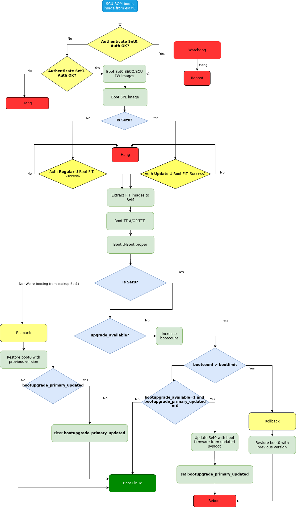

.. highlight:: sh

.. _ref-boot-software-updates-imx8qm:

Boot Software Updates on iMX8QM
===============================

Boot Artifacts
--------------

``imx-boot`` Image
~~~~~~~~~~~~~~~~~~

The ``imx-boot`` image is the first boot image container set by CSU ROM.
It consists of two containers:

-  SECO container for SECO FW
-  SCU container for SCU FW, and optional AP IPL (Cortex A processing domain),
   CM4 FW and DDR init images

By default, U-Boot SPL is used as the main AP IPL image.
The SECO container is always signed, and is provided by NXP®.
The SCU container can be signed by you or the OEM vendor.

Here is an example of typical boot image container set layout:

::

     ---------------------------
    |    1st Container Header   |
     ---------------------------
    |    1st Signature Block    |
     ---------------------------
    | Padding for 1KB alignment |
     ---------------------------
    |    2nd Container Header   |
     ---------------------------
    |    2nd Signature Block    |
     ---------------------------
    |          SECO FW          |
     ---------------------------
    |    SCU FW with DDR init   |
     ---------------------------
    |          CM4 Image        |
     ---------------------------
    |    Cortex-A FW (AP IPL)   |
     ---------------------------

U-Boot FIT Image
~~~~~~~~~~~~~~~~

"U-boot FIT-image" is a generic name for the signed FIT-image containing U-Boot proper (``u-boot.bin``) and a host of other firmware.
This file is verified by SPL via a public key stored in SPL’s dtb.
This artifact may be signed—on closed boards—as a part of CI, and can be included automatically in a boot software OTA package.

-  ``U-boot-nodtb.bin``
-  ``U-boot.dtb``
-  OP-TEE
-  Arm Trusted Firmware (ARMv8)

If the CI signing key has been rotated since the last OTA, then the SPL.dtb verification data needs to be updated prior to booting the new U-Boot FIT-image.

MMC Boot Image Layout
---------------------

According to the  *5.8.2.2.1 High Level eMMC Boot Flow Note* (iMX8QM Reference manual), for the eMMC boot scenarios where the images are located in the boot partition, the boot image set selection is done based on ``BOOT_PARTITION_ENABLE`` eMMC ``ECSD`` register values.
This means that the secondary boot image set should be flashed to the ``boot1`` hw partition from the same offset (``0x0``) as the primary one.

Update Procedure
----------------

Primary vs Secondary Boot Paths
~~~~~~~~~~~~~~~~~~~~~~~~~~~~~~~

iMX8QM SoC supports two different container sets of boot images:

-  Primary Boot Container set (Set0)
-  Secondary Boot Container set (Set1) (optional)

SCU ROM reads the headers for both, then selects the container set with the newer SW version for Primary boot path.
The container set with the older SW vesion becomes the  Secondary boot path.

In the case where the versions are equal, SCU ROM picks Set0.

Unfortunately, the SoC does not provide mechanisms for the user to control in runtime what container set to boot, such as setting the ``PERSIST\_SECONDARY\_BOOT`` bit  ``SRC\_GPR10``.
In response to this, in our setup we do not rely on different SW versions of Image Container Sets.
Instead we use Set0  as the Primary boot path, and Set1 as a recovery path (Secondary boot path).

Libaktualizr and Aktualizr-Lite
~~~~~~~~~~~~~~~~~~~~~~~~~~~~~~~

1. Aktualizr-lite decides if boot firmware needs to be updated based on ``${ostree\_root}/usr/lib/firmware/version.txt``, where ``ostree\_root`` is the root of newly deployed ostree sysroot.
   Example of contents: ``bootfirmware\_version=10``
2. After parsing ``bootfirmware\_version``, it compares the new version number with the existing one.
   This is obtained via ``fiovb`` or ``ubootenv``.
3. If ``bootfirmware\_version`` from ``version.txt`` is higher than the existing one, aktualizr-lite sets ``bootupgrade\_available`` via ``fiovb`` or ``ubootenv``.
4. Reboot should be performed.

U-Boot ``boot.cmd`` Script
~~~~~~~~~~~~~~~~~~~~~~~~~~

   Boot firmware upgrade flow for iMX8QM

1. Actual update is done via U-Boot ``boot.cmd`` (``boot.scr``) script.
2. ``boot.cmd`` checks if primary path is booted.
3. In case ``upgrade\_available`` is set, check if boot firmware upgrade is needed by checking the ``bootupgrade\_available`` flag.
   If both are true, obtain boot firmware images from the newly deployed ostree sysroot and write them to the primary boot path offsets.
   Next ``bootupgrade\_primary\_updated`` is set, and regular reset is issued.
4. After reboot, SCU ROM tries to boot the newly updated images from the primary boot path (Set0).
   If image verification fails, automatically fall back to Set1.
   If Set1 is booted—meaning verification of Set0 failed—the rollback procedure will be issued, and the previous version of Set0 will be restored.
   Conversely, if Set0 is booted but ``bootcount`` hits ``bootlimit`` (meaning the boot procedure did not finish successfully), the rollback procedure will be also issued.
5. After Linux boots, aktualizr-lite confirms a successful update by clearing ``upgrade\_available``.
   At this point new boot firmware images are already validated.
   An additional reboot is needed after this step.
6. After reboot, U-Boot checks if ``bootupgrade\_primary\_updated`` is set and ``upgrade\_available`` is cleared.
   This means aktualizr-lite has confirmed a successful boot, and U-Boot clears ``bootupgrade\_primary\_updated``.
   Otherwise ``bootcount`` is incremented.

Add a New Board
---------------

``meta-lmp``
~~~~~~~~~~~~

``mfgtool`` Scripts
^^^^^^^^^^^^^^^^^^^

To deploy boot images to the destination board, the mfgtools package is used.
It uses a special configuration file with uuu extensions
This contains all the instructions need for the correct deployment of boot images.
Default uuu files do not support flashing images for secondary boot path.
The appropriate adjustments should be made: adding secondary imx-boot, and U-Boot FIT deployment steps:

::

    +FB: flash bootloader2 ../u-boot-@@MACHINE@@.itb
    +FB: flash bootloader2_s ../u-boot-@@MACHINE@@.itb

The final uuu script looks like:

::

    uuu_version 1.3.102

    SDPS: boot -f imx-boot-mfgtool
    CFG: FB: -vid 0x0525 -pid 0x4000
    CFG: FB: -vid 0x0525 -pid 0x4025
    CFG: FB: -vid 0x0525 -pid 0x402F
    CFG: FB: -vid 0x0525 -pid 0x4030
    CFG: FB: -vid 0x0525 -pid 0x4031

    SDPU: delay 1000
    SDPU: write -f imx-boot-mfgtool -offset 0x57c00
    SDPU: jump

    # These commands will be run when use SPL and will be skipped if no spl
    # if (SPL support SDPV)
    # {
    SDPV: delay 1000
    SDPV: write -f u-boot-mfgtool.itb
    SDPV: jump
    # }

    FB: ucmd setenv fastboot_dev mmc
    FB: ucmd setenv mmcdev 0
    FB: ucmd mmc dev ${mmcdev} 1; mmc erase 0 0x3FFE
    FB: flash -raw2sparse all ../@@MFGTOOL_FLASH_IMAGE@@-@@MACHINE@@.wic
    FB: flash bootloader ../imx-boot-@@MACHINE@@
    FB: flash bootloader_s ../imx-boot-@@MACHINE@@
    FB: flash bootloader2 ../u-boot-@@MACHINE@@.itb
    FB: flash bootloader2_s ../u-boot-@@MACHINE@@.itb
    FB: ucmd mmc partconf 0 0 1 0
    FB: done

``lmp.cfg`` Files
^^^^^^^^^^^^^^^^^

To enable support for flashing/booting secondary boot images, adjust both the default ``lmp.cfg``, and the one for mfgtools.
The following config options need to be added to the default ``lmp.cfg``:

::

    CONFIG_CMD_SECONDARY_BOOT=y
    CONFIG_SECONDARY_BOOT_SECTOR_OFFSET=0x0
    CONFIG_SECONDARY_BOOT_RUNTIME_DETECTION=y

And to mfgtool ``lmp.cfg``:

::

    CONFIG_FSL_FASTBOOT_BOOTLOADER_SECONDARY=y
    CONFIG_SECONDARY_BOOT_SECTOR_OFFSET=0x0

The secondary boot path is primarily used for boot firmware update image validation.
In exceptional cases, it can behave incorrectly, causing hangs and other issues.
To cover such cases, watchdog support has to be enabled in SPL by adding config options to ``lmp.cfg``:

::

    CONFIG_IMX_WATCHDOG=y
    CONFIG_SPL_HW_WATCHDOG=y
    # CONFIG_SPL_WDT is not set
    CONFIG_SPL_WATCHDOG_SUPPORT=y

Pre-Load ``boot.cmd`` by SPL
^^^^^^^^^^^^^^^^^^^^^^^^^^^^

As ``boot.cmd`` depends on U-Boot commands for booting Linux®, it should be aligned with the U-Boot version.
By default, in setups without boot firmware update support, ``boot.cmd`` is stored in the first FAT partition in eMMC/SD.
To get ``boot.cmd`` updates—together with other boot software images—it should be moved from the FAT partition, to the U-Boot FIT image.
To do this, edit ``lmp-machine-custom.inc``, adding this line for your board (imx8mqevk used as an example):

::

    BOOTSCR_LOAD_ADDR_imx8qmmek = "0x44800000"

This change will include Linux ``boot.cmd`` into the U-Boot FIT image, alongside TF-A/OP-TEE/U-Boot proper/U-Boot dtb images.
When SPL parses the U-Boot FIT image (``u-boot.itb``) it will pre-load ``boot.itb`` (compiled and wrapped ``boot.cmd``) to the address specified in ``BOOTSCR\_LOAD\_ADDR`` variable.

To let U-Boot know where to get the boot script from, you should also adjust ``CONFIG\_BOOTCOMMAND`` in the U-Boot ``lmp.cfg`` of your board.

::

    CONFIG_BOOTCOMMAND="setenv verify 1; source 0x44800000; reset"

Test Basic API
~~~~~~~~~~~~~~

After applying all the updates from previous steps, we should validate that everything is in place.
This consists of two basic steps:

- Boot container set detection (primary or secondary)
- Obtain board security state (open/closed states)

To test Boot container set detection, use the U-Boot command ``imx\_secondary\_boot``.

Example of test:

::

    u-boot=> imx_secondary_boot
    Secondary boot bit = 0

To check if the security status of your board is detected correctly, use the ``imx\_is\_closed`` command:

::

    u-boot=> imx_is_closed
    Board is in open state

``boot.cmd``
~~~~~~~~~~~~

Currently, LmP uses template-based generation for the final ``boot.cmd``.
It is constructed from common boot files (``./meta-lmp-base/recipes-bsp/u-boot/u-boot-ostree-scr-fit``),
which contains all SoC agnostic ``DEFINE`` statements and common functionality, and board specific ``boot.cmd``, which includes the common scripts.

Example of board ``boot.cmd``
(``./meta-lmp-bsp/recipes-bsp/u-boot/u-boot-ostree-scr-fit/imx8qm-mek/boot.cmd``):

::

    setenv fdt_file imx8qm-mek.dtb
    echo "Using freescale_${fdt_file}"

    # Default boot type and device
    setenv bootlimit 3
    setenv devtype mmc
    setenv devnum 0
    setenv bootpart 1
    setenv rootpart 2
    setenv hdmi_image hdmitxfw.bin
    setenv m4_0_image core0_m4_image.bin
    setenv m4_1_image core1_m4_image.bin
    setenv ramdisk_addr_r 0x8a000000
    # enable relocation of ramdisk
    setenv initrd_high

    # Boot image files
    setenv fit_addr ${ramdisk_addr_r}
    setenv fdt_file_final freescale_${fdt_file}

    setenv bootcmd_boot_hdmi 'hdp load ${loadaddr}'
    setenv bootcmd_boot_m4_0 'dcache flush; bootaux ${loadaddr} 0'
    setenv bootcmd_boot_m4_1 'dcache flush; bootaux ${loadaddr} 1'
    setenv bootcmd_load_hdmi 'if imxtract ${ramdisk_addr_r}#conf@@FIT_NODE_SEPARATOR@@freescale_${fdt_file} loadable@@FIT_NODE_SEPARATOR@@${hdmi_image} ${loadaddr}; then run bootcmd_boot_hdmi; fi'
    setenv bootcmd_load_m4_0 'if imxtract ${ramdisk_addr_r}#conf@@FIT_NODE_SEPARATOR@@freescale_${fdt_file} loadable@@FIT_NODE_SEPARATOR@@${m4_0_image} ${loadaddr}; then run bootcmd_boot_m4_0; fi;'
    setenv bootcmd_load_m4_1 'if imxtract ${ramdisk_addr_r}#conf@@FIT_NODE_SEPARATOR@@freescale_${fdt_file} loadable@@FIT_NODE_SEPARATOR@@${m4_1_image} ${loadaddr}; then run bootcmd_boot_m4_1; fi;'
    setenv bootcmd_load_fw 'run bootcmd_load_hdmi; run bootcmd_load_m4_0; run bootcmd_load_m4_1;'

    # Boot firmware updates

    # Offsets are in blocks (512 bytes each)
    setenv bootloader 0x0
    setenv bootloader2 0x400
    setenv bootloader_s ${bootloader}
    setenv bootloader2_s ${bootloader2}
    setenv bootloader_image "imx-boot"
    setenv bootloader_s_image ${bootloader_image}
    setenv bootloader2_image "u-boot.itb"
    setenv bootloader2_s_image ${bootloader2_image}

    setenv update_image_boot0 'echo "${fio_msg} writing ${image_path} ..."; run set_blkcnt && mmc dev ${devnum} 1 && mmc write ${loadaddr} ${start_blk} ${blkcnt}'

    setenv backup_primary_image 'echo "${fio_msg} backing up primary boot image set ..."; mmc dev ${devnum} 1 && mmc read ${loadaddr} 0x0 0x3FFE && mmc dev ${devnum} 2 && mmc write ${loadaddr} 0x0 0x3FFE'
    setenv restore_primary_image 'echo "${fio_msg} restore primary boot image set ..."; mmc dev ${devnum} 2 && mmc read ${loadaddr} 0x0 0x3FFE && mmc dev ${devnum} 1 && mmc write ${loadaddr} 0x0 0x3FFE'

    setenv update_primary_image1 'if test "${ostree_deploy_usr}" = "1"; then setenv image_path "${bootdir}/${bootloader_s_image}"; else setenv image_path "${ostree_root}/usr/lib/firmware/${bootloader_s_image}"; fi; setenv start_blk "${bootloader_s}";  run load_image; run update_image_boot0'
    setenv update_primary_image2 'if test "${ostree_deploy_usr}" = "1"; then setenv image_path "${bootdir}/${bootloader2_s_image}"; else setenv image_path "${ostree_root}/usr/lib/firmware/${bootloader2_s_image}"; fi; setenv start_blk "${bootloader2_s}";  run load_image; run update_image_boot0'

    setenv update_primary_image 'run update_primary_image1; run update_primary_image2'

    setenv do_reboot "reboot"

    @@INCLUDE_COMMON_IMX@@
    @@INCLUDE_COMMON_ALTERNATIVE@@

Sysroot and Signed Boot Artifacts
~~~~~~~~~~~~~~~~~~~~~~~~~~~~~~~~~

All boot artifacts (SPL/imx-boot and U-Boot FIT) are automatically deployed to sysroot during build time.
However, on closed boards where the initial boot image has to be signed in advance by a subscriber private key,
there is way to add a signed binary instead of automatic inclusion of unsigned boot artifacts.

To do this, add ``lmp-boot-firmware.bbappend`` to your ``meta-subscriber-overrides`` layer, adding the path to the signed binary and the signed binary itself.
Next, define the boot firmware version by setting the ``LMP_BOOT_FIRMWARE_VERSION`` global variable in your ``lmp-factory-custom.inc``.
Boot firmware version information will be automatically added to ``${osroot}/usr/lib/firmware/version.txt`` and the U-Boot Device Tree Blob.

Example:

::

    diff --git a/recipes-bsp/lmp-boot-firmware/lmp-boot-firmware.bbappend b/recipes-bsp/lmp-boot-firmware/lmp-boot-firmware.bbappend
    new file mode 100644
    index 0000000..6c11380
    --- /dev/null
    +++ b/recipes-bsp/lmp-boot-firmware/lmp-boot-firmware.bbappend
    @@ -0,0 +1,7 @@
    +FILESEXTRAPATHS:prepend := "${THISDIR}/${PN}:"
    +
    +SRC_URI = " \
    +       file://imx-boot \
    +"
    diff --git a/recipes-bsp/lmp-boot-firmware/lmp-boot-firmware/imx-boot b/recipes-bsp/lmp-boot-firmware/lmp-boot-firmware/imx-boot
    new file mode 100644
    index 0000000..50f5013
    Binary files /dev/null and b/recipes-bsp/lmp-boot-firmware/lmp-boot-firmware/imx-boot differ
    --- a/conf/machine/include/lmp-factory-custom.inc
    +++ b/conf/machine/include/lmp-factory-custom.inc
    @@ -22,4 +22,4 @@ UEFI_SIGN_KEYDIR = "${TOPDIR}/conf/factory-keys/uefi"
     # TF-A Trusted Boot
     TF_A_SIGN_KEY_PATH = "${TOPDIR}/conf/factory-keys/tf-a/privkey_ec_prime256v1.pem"

    +LMP_BOOT_FIRMWARE_VERSION:imx8qm-mek = "3"

.. note::
   As ``LMP_BOOT_FIRMWARE_VERSION`` is now the preferred way to set boot firmware version,
   defining ``PV`` in ``lmp-boot-firmware.bbappend`` is deprecated and should not be used.
   To switch to the new approach, remove ``PV = "<version>"`` from ``lmp-boot-firmware.bbappend``,
   and define ``LMP_BOOT_FIRMWARE_VERSION`` with the appropriate version value as shown above in the example.

.. seealso::
   * :ref:`ref-secure-boot-imx-ahab`
