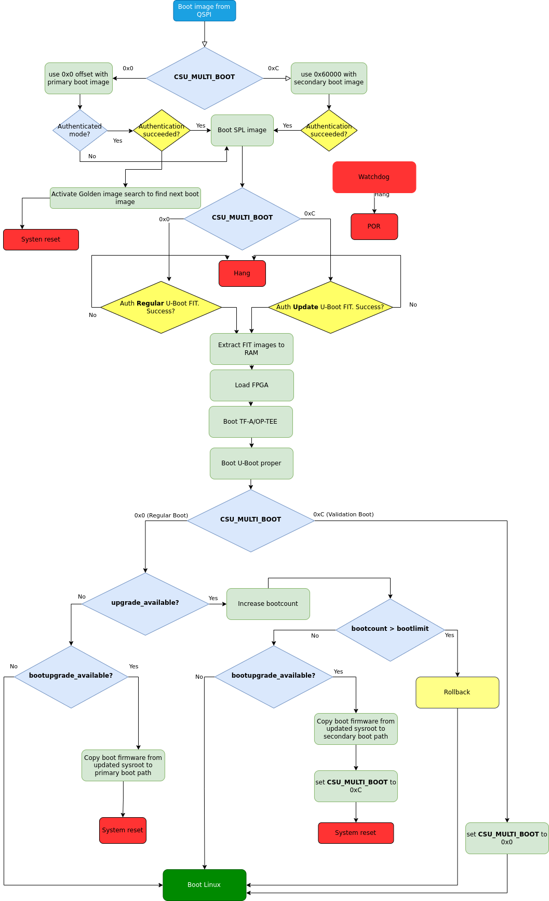

.. highlight:: sh

.. _ref-boot-software-updates-zynqmp:

Boot Software Updates on Zynq UltraScale+ MPSoC
===============================================

Boot artifacts
--------------

Boot image
~~~~~~~~~~

Boot image is generated by the **bootgen** tool. It
contains PEK keys (in case secure boot is enabled), Platform Management
Unit (PMU) firmware and Secondary Program Loader (SPL), which is obtained
from U-Boot build.

U-Boot FIT image
~~~~~~~~~~~~~~~~

U-boot FIT-image is a generic name for the signed FIT-image that
contains U-Boot proper (``u-boot.bin``) and a host of other firmware.
This file is verified by SPL via a public key stored in SPL's dtb.

-  U-boot-nodtb.bin
-  U-boot.dtb
-  OP-TEE
-  Arm Trusted Firmware (ARMv8)
-  FPGA firmware
-  Boot script (bootscr)

If the CI signing key has been rotated since the last OTA, then we need
to also update the ``SPL.dtb`` verification data prior to trying to boot the
new U-Boot FIT-image.

Boot media
----------

Currently, Boot software updates are supported on both MMC and QSPI boot media,
however it requires different boot image layout for these two different cases.

Golden Image Search
~~~~~~~~~~~~~~~~~~~

The golden image search is a mechanism, which BootROM uses to search for
a valid boot header to load and run a boot image. For boot header validation,
the BootROM looks for the identification string **XLNX** (or **XNLX** in the
latest revisions). When a valid identification string is found in the boot
header, the checksum for the boot header is checked. If the checksum is valid,
the rest of the boot header and the rest of the boot image (including the SPL)
are loaded into the RPU or APU memory for further processing.

If an image header is invalid, the BootROM increments the image header
address register by **32 KB** and tries again. The offset which is used by
BootROM for loading boot image can be also enforced by the user.
This is achieved by writing the boot offset value into the **CSU_MULTI_BOOT**
register and issuing a system reset (not a POR).

Based on boot media used, **CSU_MULTI_BOOT** value indicates different things:

* In **QSPI** boot case multi_boot value represents multiple of 32 KB (as
  boot image should be placed on 32 KB boundary), so to force BootROM to
  boot image from **0x60000** offset on QSPI, **CSU_MULTI_BOOT** register
  value needs to be set to **0xC** (or **12** in dec) because
  `0x60000 = 0x8000 * 0xC`, where **0x8000** is the 32KB boundary and
  **0xC** is the multiboot value.
* In **MMC** boot case, BootROM requires boot images to be stored on
  the first FAT partition with a specific naming convention. The filenames
  of the boot images should contain multiboot offset, represented by 4 figures,
  for example **boot0005.bin**. BootROM will boot this file if
  the **CSU_MULTI_BOOT** is set to **5**.

The boot image search mechanism is only available for the Quad-SPI,
NAND, SD and eMMC boot modes.

MMC Boot Image Layout
~~~~~~~~~~~~~~~~~~~~~

All boot images (both ``boot.bin`` and FIT images) are stored in the first
FAT partition on MMC with this naming convention:

::

    boot0001.bin       - primary boot image
    boot0002.bin       - secondary boot image
    u-boot0001.itb     - primary FIT image
    u-boot0002.itb     - secondary FIT image

QSPI Boot Image Layout
~~~~~~~~~~~~~~~~~~~~~~

All boot images (both ``boot.bin`` and FIT images) are written as raw images
using these predetermined offsets:

::

    0x0                - primary boot.bin
    0x60000            - secondary boot.bin
    0x100000           - primary u-boot.itb
    0xaa0000           - secondary u-boot.itb

Boot Flow
---------

PMU BootROM
~~~~~~~~~~~
#.  Reset and initialize CSU, prepare for the configuration stage
#.  Release the reset of CSU
#.  Enter a servicing mode

CSU BootROM
~~~~~~~~~~~
#.  Determine the boot mode
#.  Activate golden image search mechanism
#.  Load a boot image
#.  Perform verification of boot image (in case secure boot is enabled)
#.  Extract SPL and PMU firmware from boot image
#.  Load PMU firmware
#.  Load and jump to SPL

SPL
~~~

#.  Initialize DDR
#.  Calculate filename (MMC boot)/ QSPI offset for the FIT image
#.  Load U-Boot FIT-image
#.  Perform verification
#.  Extract components
#.  Load FPGA firmware
#.  Jump to ATF / OP-TEE

ATF (ARMv8)
~~~~~~~~~~~

#.  Perform memory permission setup
#.  Drop to EL-2 non-secure
#.  Jump to OP-TEE

OP-TEE
~~~~~~

#.  Perform secure world setup
#.  Driver init
#.  Load TAs
#.  Drop to EL-2 secure world
#.  Jump to u-boot.bin

U-Boot
~~~~~~

#.  Driver init
#.  Boot script
#.  Load kernel FIT-image
#.  Perform verification
#.  Extract components
#.  Jump to Linux kernel

Update procedure
----------------

Primary vs Secondary boot paths
~~~~~~~~~~~~~~~~~~~~~~~~~~~~~~~

As mentioned in the Golden image search section, the offset which is used by
BootROM for loading boot image can be also enforced by the user, which implies
that multiple boot image can be stored on the media. This gives a
possibility to use A/B approach in the Over-The-Air updates, where A (primary
boot path) - represents stable boot image set, and B (secondary boot path) -
newly updated not-validated-yet images.

libaktualizr and aktualizr-lite
~~~~~~~~~~~~~~~~~~~~~~~~~~~~~~~

1. aktualizr-lite makes decision if boot firmware needs to be updated based
   on the contents of ``${ostree\_root}/usr/lib/firmware/version.txt``,
   where ostree\_root is root of newly deployed ostree sysroot. Example
   of contents: **bootfirmware\_version=10**
2. After parsing bootfirmware\_version, it compares version number with
   the existing one, which is obtained via **fiovb** or **ubootenv**.
3. If bootfirmware\_version from ``version.txt`` is higher than existing
   one, aktualizr-lite sets **bootupgrade\_available** via **fiovb** or
   **ubootenv**.
4. Reboot should be performed.

U-Boot boot.cmd script
~~~~~~~~~~~~~~~~~~~~~~

   Boot firmware upgrade flow for QSPI boot

1. Actual update is done via U-Boot ``boot.cmd`` script.
2. ``boot.cmd`` script checks if primary path is booted.
3. In case **upgrade\_available** is set check if boot firmware
   upgrade is needed is done by looking into **bootupgrade\_available** flag.
   If both are true, boot firmware images are obtained from newly
   deployed ostree sysroot and then written to the secondary boot path offsets.
   After that multi_boot offset value is set and then system reset is
   issued to enforce BootROM to boot secondary boot path.
4. After reboot secondary boot path is executed, condition verification from
   step 2 is being checked again, which this time is not true so just
   regular boot of Linux is done.
5. After Linux is booted aktualizr-lite confirms successful update by clearing
   **upgrade\_available** flag. At this point new boot firmware images are
   already validated and now they have to be flashed to the stable
   primary path. Additional reboot is needed after this step.
6. Regular reset

Add a new board
---------------

U-Boot
~~~~~~

SPL: FIT filename calculation during MMC boot
^^^^^^^^^^^^^^^^^^^^^^^^^^^^^^^^^^^^^^^^^^^^^

U-Boot SPL automatically detects what next image to boot based on
**CSU_MULTI_BOOT** register value. In MMC boot BootROM expects all boot
images to be stored on the first FAT partition and we need to boot correct
FIT image which corresponds to the multiboot offset. Below is an example of
how final filename of FIT image is calculated on ZynqMP SoCs
(extract from *board/xilinx/zynqmp/zynqmp.c*):

::

    int spl_mmc_get_uboot_payload_filename(char *filename, size_t len,
                                           const u32 boot_device)
    {
            int ret;
            u32 multiboot;

            if (!filename)
                    return -1;

            multiboot = multi_boot_get();

            if (multiboot)
                    ret = snprintf(filename, len, "u-boot%04d.itb", multiboot);
            else
                    ret = snprintf(filename, len, "u-boot.itb");

            if (ret < 0) {
                    printf("Can't construct SPL payload filename");
                    return ret;
            }

            printf("SPL: Booting %s\n", filename);

            return 0;
    }

SPL: FIT offset calculation during QSPI boot
^^^^^^^^^^^^^^^^^^^^^^^^^^^^^^^^^^^^^^^^^^^^
The offset for the FIT image is calculated based on the current value of
**CSU_MULTI_BOOT** register. The multiboot value is multiplied by **0x8000**
(32 Kb boundary), and then the final value is used as offset of the raw FIT
image on QSPI. Below is an example of how final offset is
calculated on ZynqMP SoCs (extract from *board/xilinx/zynqmp/zynqmp.c*):

::

    unsigned int spl_spi_get_uboot_offs(struct spi_flash *flash)
    {
            int ret;
            u32 multiboot;
            u32 payload_offset = 0;
            u32 boot_image_offset = 0x0;

            multiboot = multi_boot_get();
            boot_image_offset = golden_image_boundary * multiboot;

            /*
             * Default values are:
             * Primary boot.bin offset   - 0x0 (multiboot == 0)
             * Secondary boot.bin offset - 0x50000 (multiboot == 10,
             *                             as 10 * 32KB == 0x50000)
             */
            if (boot_image_offset == CONFIG_SYS_SPI_BOOT_IMAGE_OFFS) {
                    payload_offset = CONFIG_SYS_SPI_U_BOOT_OFFS;
            } else if (boot_image_offset == CONFIG_SYS_SPI_BOOT_IMAGE_OFFS2) {
                    payload_offset = CONFIG_SYS_SPI_U_BOOT_OFFS2;
            } else {
                    printf("Invalid value of multiboot register, value = %d\n",
                           multiboot);
                    hang();
            }

            printf("SPL: Booting next image from 0x%x SPI offset\n",
                   payload_offset);

            return payload_offset;
    }

meta-lmp
~~~~~~~~

lmp.cfg files (QSPI boot)
^^^^^^^^^^^^^^^^^^^^^^^^^

To enable support of multiboot suppart adjust regular **lmp.cfg** of
your board. These config options should be added:

::

    CONFIG_SYS_SPI_BOOT_IMAGE_OFFS=0x0
    CONFIG_SYS_SPI_BOOT_IMAGE_OFFS2=0x60000
    CONFIG_SYS_SPI_U_BOOT_OFFS=0x100000
    CONFIG_SYS_SPI_U_BOOT_OFFS2=0xaa0000

These values correspond to the offsets of primary and secondary boot image
sets (``boot.bin`` and ``u-boot.itb``).

Pre-load boot.cmd by SPL
^^^^^^^^^^^^^^^^^^^^^^^^

As ``boot.cmd`` script depends on U-Boot cmds for booting Linux, it should be
aligned with U-Boot version. By default in regular setups without boot firmware
update support ``boot.cmd`` is stored in first FAT partition in eMMC/SD.
So to get ``boot.cmd`` updates together with other boot software images,
it should be moved from FAT partition to U-Boot FIT image. To do that edit
**lmp-machine-custom.inc** adding this line for your board:

::

    BOOTSCR_LOAD_ADDR:sota = "0x21000000"

This change will include Linux **boot.cmd** into U-Boot FIT image
alongside with TF-A/OP-TEE/U-Boot proper/U-Boot dtb images. When SPL
parses U-Boot FIT image (u-boot.itb) will pre-load **boot.itb**
(compiled and wrapped **boot.cmd**) to the address specified in
**BOOTSCR\_LOAD\_ADDR** variable.

To let U-Boot know where to take boot script from, you should also
adjust **CONFIG\_BOOTCOMMAND** param in your U-Boot **lmp.cfg** of your
board.

::

    CONFIG_BOOTCOMMAND="setenv verify 1; source 0x44800000; reset"

Test basic API
~~~~~~~~~~~~~~

After applying all updates from previous steps, we should validate that
everything is in place. Basically this consists of two basic steps:

- multi_boot U-Boot cmd is functional
- Obtain board security state (open/closed states)

So to test booting primary/secondary boot path use these two U-Boot commands
**multi\_boot** and **reset**.

Example of test:

::

    U-Boot SPL 2022.01+xlnx+g9039256f80 (Jan 24 2022 - 14:57:34 +0000)
    ...
    Chip ID:	zu3eg
    Multiboot:	0
    Trying to boot from SPI
    SPL: Booting next image from 0x100000 SPI offset
    .....
    ZynqMP> multi_boot 0xc && reset
    Set multiboot register to: 	0xc (dec: 12)
    QSPI boot offset to be used after reboot: 	0x60000
    resetting ...

    U-Boot SPL 2022.01+xlnx+g9039256f80 (Jan 24 2022 - 14:57:34 +0000)
    ....
    Multiboot:	12
    Trying to boot from SPI
    SPL: Booting next image from 0xaa0000 SPI offset

From the output you can see that after setting the secondary boot (`multi_boot 12` or
`multi_boot 0xc` as both dec and hex values are supported)
and performing reset, BootROM boots images from secondary boot path
(*SPL: Booting next image from 0xaa0000 SPI offset*).

To check if the security status of your board is detected correctly, use
**is\_boot\_authenticated** command:

::

    ZynqMP> is_boot_authenticated
    Board is in open state

boot.cmd
~~~~~~~~

Currently LmP uses template-based way of generation of final ``boot.cmd``.
It's constructed from common boot files
(*./meta-lmp-base/recipes-bsp/u-boot/u-boot-ostree-scr-fit/boot-common.cmd.in*),
which contains SoC agnostic DEFINEs and common functionality, and board
specific ``boot.cmd``, which is included `boot-common.cmd.in`.

Example of board ``boot.cmd``
(*./meta-lmp-bsp/recipes-bsp/u-boot/u-boot-ostree-scr-fit/uz/boot.cmd*):

::

    # set default fdt_file
    setenv fdt_file system-top.dtb
    echo "Using ${fdt_file}"

    # Default boot type and device
    setenv bootlimit 3
    setenv devtype mmc
    setenv devnum ${bootseq}
    setenv bootpart 1
    setenv rootpart 2

    setenv loadaddr 0x10000000
    setenv fdt_addr 0x40000000
    setenv optee_ovl_addr 0x22000000
    setenv fdt_file_final ${fdt_file}
    setenv fit_addr ${ramdisk_addr_r}

    setenv bootloader_image "boot.bin"
    setenv bootloader_s_image ${bootloader_image}
    setenv bootloader2_image "u-boot.itb"
    setenv bootloader2_s_image ${bootloader2_image}

    setenv check_board_closed "is_boot_authenticated"
    setenv check_secondary_boot "multi_boot"

    # Boot images (primary and secondary)
    setenv bootloader_image_update 'boot0001.bin'
    setenv bootloader_s_image_update 'boot0002.bin'

    # FIT image (primary and secondary)
    setenv bootloader2_image_update 'u-boot0001.itb'
    setenv bootloader2_s_image_update 'u-boot0002.itb'

    setenv set_primary_boot "multi_boot 1"
    setenv set_secondary_boot "multi_boot 2"

    # Writing images
    run setup_update
    setenv update_primary_image 'echo "${fio_msg} writing ${image_path} ..."; setenv run_update "${update_cmd} ${bootloader_image_update} ${filesize}"; run run_update'
    setenv update_secondary_image 'echo "${fio_msg} writing ${image_path} ..."; setenv run_update "${update_cmd} ${bootloader_s_image_update} ${filesize}"; run run_update'
    setenv update_primary_image2 'echo "${fio_msg} writing ${image_path} ..."; setenv run_update "${update_cmd} ${bootloader2_image_update} ${filesize}"; run run_update'
    setenv update_secondary_image2 'echo "${fio_msg} writing ${image_path} ..."; setenv run_update "${update_cmd} ${bootloader2_s_image_update} ${filesize}"; run run_update'

    @@INCLUDE_COMMON@@

sysroot and signed boot artifacts
~~~~~~~~~~~~~~~~~~~~~~~~~~~~~~~~~

All boot artifacts (boot.bin and U-Boot FIT) are automatically deployed
to sysroot during build time, however on closed boards, where initial boot
image has to be signed in advance by a subscriber's private key, there is way
to add signed binary instead of automatic inclusion of unsigned boot
artifacts.

To do that just **lmp-boot-firmware.bbappend** to your
*meta-subscriber-overrides* layer, adding proper value of PV (boot firmware
version, which will be automatically added to
``${osroot}/usr/lib/firmware/version.txt`` file), path to signed binary and
signed binary itself.

Example:
::

    diff --git a/recipes-bsp/lmp-boot-firmware/lmp-boot-firmware.bbappend b/recipes-bsp/lmp-boot-firmware/lmp-boot-firmware.bbappend
    new file mode 100644
    index 0000000..6c11380
    --- /dev/null
    +++ b/recipes-bsp/lmp-boot-firmware/lmp-boot-firmware.bbappend
    @@ -0,0 +1,7 @@
    +FILESEXTRAPATHS:prepend := "${THISDIR}/${PN}:"
    +
    +PV = "1"
    +
    +SRC_URI = " \
    +       file://SPL \
    +"
    diff --git a/recipes-bsp/lmp-boot-firmware/lmp-boot-firmware/SPL b/recipes-bsp/lmp-boot-firmware/lmp-boot-firmware/SPL
    new file mode 100644
    index 0000000..50f5013
    Binary files /dev/null and b/recipes-bsp/lmp-boot-firmware/lmp-boot-firmware/SPL differ

Deploy boot images to QSPI flash
--------------------------------

If QSPI is chosen as the main boot media in your device design, you can
use U-Boot (loaded via serial console mode or from another boot media)
shell for image provisioning to corresponding offsets on QSPI:

::

    ZynqMP> sf probe; setenv loadaddr 0x8000000; mmc dev ${bootseq}; fatload mmc ${bootseq}:1 ${loadaddr} boot0001.bin; sf update ${loadaddr} 0x0 ${filesize}; sf update ${loadaddr} 0x60000 ${filesize}; fatload mmc ${bootseq}:1 ${loadaddr} u-boot0001.itb; sf update ${loadaddr} 0x100000 ${filesize}; sf update ${loadaddr} 0xaa0000 ${filesize};
    SF: Detected n25q256ax1 with page size 512 Bytes, erase size 128 KiB, total 64 MiB
    switch to partitions #0, OK
    mmc1 is current device
    280752 bytes read in 37 ms (7.2 MiB/s)
    device 0 offset 0x0, size 0x448b0
    0 bytes written, 280752 bytes skipped in 0.405s, speed 709851 B/s
    device 0 offset 0x60000, size 0x448b0
    0 bytes written, 280752 bytes skipped in 0.405s, speed 709851 B/s
    7179209 bytes read in 505 ms (13.6 MiB/s)
    device 0 offset 0x100000, size 0x6d8bc9
    0 bytes written, 7179209 bytes skipped in 7.433s, speed 1025601 B/s
    device 0 offset 0xaa0000, size 0x6d8bc9
    0 bytes written, 7179209 bytes skipped in 7.433s, speed 1025601 B/s
