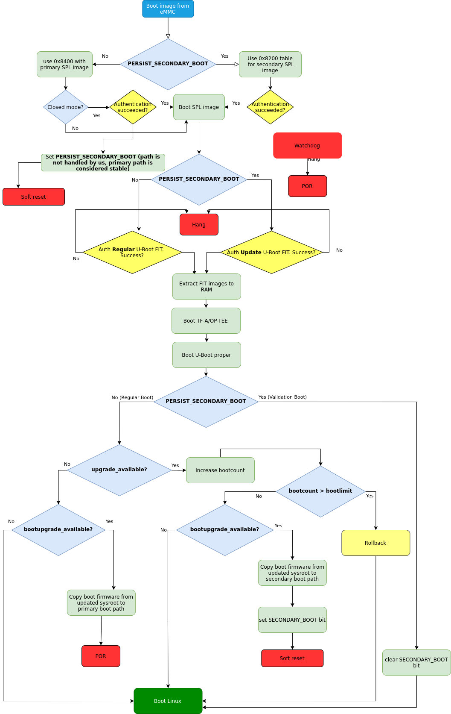
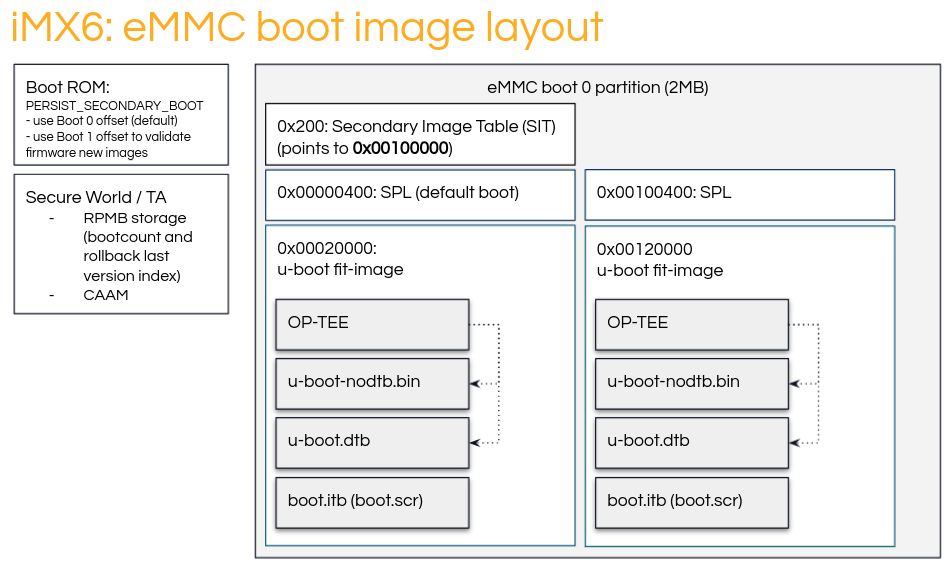
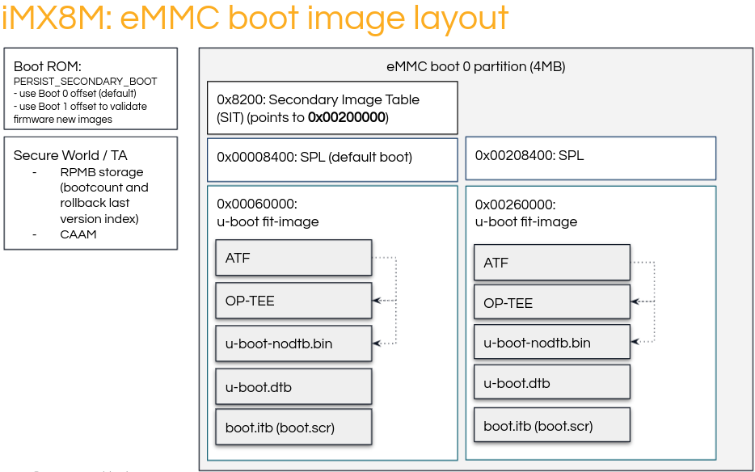

.. highlight:: sh

.. _ref-boot-software-updates:

Boot Software Updates
=====================

Boot artifacts
--------------

SPL
~~~

SPL is the first software loader generated by the i.MX U-Boot build. It
is signed via the NXP CST tool which fills in various IVT header fields.
SPL binaries from CI CANNOT be added directly to OTA due to the missing
signature data which must be added by the subscriber.

In some cases, SoC may have embedded firmware (such as DDR firmware for
mx8m). This firmware is loaded prior to the load / verification of
U-Boot FIT-image.

U-Boot FIT image
~~~~~~~~~~~~~~~~

U-boot FIT-image is a generic name for the signed FIT-image that
contains u-boot.bin and a host of other firmware. This file is verified
by SPL via a public key stored in SPL’s dtb. This artifact is signed as
a part of CI and CAN be included automatically in a boot software OTA
package.

-  U-boot-nodtb.bin
-  U-boot.dtb
-  OP-TEE
-  Arm Trusted Firmware (ARMv8)
-  Possible other firmwares (SECO/SCU?)

If the CI signing key has been rotated since the last OTA, then we need
to also update the SPL.dtb verification data prior to trying to boot the
new U-Boot FIT-image.

MMC boot image layout
---------------------

|image of iMX6 layout| |image of iMX8M layout|

Secondary Image Table (SIT) is a 20 byte long structure containing of 5
32-bit words.Those encode bootloader B-copy area offset (called
**firstSectorNumber**), magic value (called **tag**) that is always
**0x00112233**, and three unused words set to 0. Example SIT are below:

::

    $ hexdump -vC sit-mx8mm.bin
      00000000  00 00 00 00
      00000004  00 00 00 00
      00000008  33 22 11 00 <--- This is the "tag"
      0000000c  00 10 00 00 <--- This is the "firstSectorNumber"
      00000010  00 00 00 00

Boot Flow
---------

SPL
~~~

-  Initialize DDR
-  Load U-Boot FIT-image: Failure point
-  Perform verification: Failure point
-  Extract components: Failure point
-  Jump to ATF / OP-TEE: Watchdog timeout point

ATF (ARMv8)
~~~~~~~~~~~

-  Perform memory permission setup
-  Drop to EL-2 non-secure
-  Jump to OP-TEE: Watchdog timeout point

OP-TEE
~~~~~~

-  Perform secure world setup
-  Driver init
-  Load TAs
-  Drop to EL-2 secure world
-  Jump to u-boot.bin: Watchdog timeout point

U-Boot
~~~~~~

-  Driver init
-  Boot script
-  Load kernel FIT-image: Failure point
-  Perform verification: Failure point
-  Extract components: Failure point
-  Jump to Linux kernel: Watchdog timeout point

Update procedure
----------------

Primary vs Secondary boot paths
~~~~~~~~~~~~~~~~~~~~~~~~~~~~~~~

Since **iMX53** until **iMX8MM**, it is possible to have two copies of
bootloader in SD/eMMC and switch between them. The switch can be
triggered either by the BootROM in case the bootloader image is faulty
OR can be enforced by the user.

The bootloader A-copy must be placed at predetermined offset in SD/eMMC.
The bootloader B-copy area offset is determined by an offset stored in
Secondary Image Table. The SIT must be placed at predetermined offset in
SD/eMMC.

To enforce BootROM to boot secondary boot image,
**PERSIST\_SECONDARY\_BOOT** must be set in **SRC\_GPR10** register and
warm reset has to be performed. After reboot BootROM will boot the image
using offset specified in SIT table. For additional details about SIT
format and SIT offsets please refer to your SoC RM, section *Redundant
boot support for expansion device*.

libaktualizr and ak-lite
~~~~~~~~~~~~~~~~~~~~~~~~

1. ak-lite makes decision if boot firmware needs to be updated based on
   the contents of **${ostree\_root}/usr/lib/firmware/version.txt**,
   where ostree\_root is root of newly deployed ostree sysroot. Example
   of contents: **bootfirmware\_version=10**
2. After parsing bootfirmware\_version, it compares version number with
   the existing one, which is obtained via **fiovb** or **ubootenv**.
3. If bootfirmware\_version from version.txt is higher than existing
   one, ak-lite sets **bootupgrade\_available** via **fiovb** or
   **ubootenv**.
4. Reboot should be performed.

U-Boot boot.cmd script
~~~~~~~~~~~~~~~~~~~~~~

   Boot firmware upgrade flow

1. Actual update is done via U-Boot **boot.cmd** (boot.scr) script.
2. **boot.cmd** script checks if we’re booting secondary path
3. In case **upgrade\_available** is set we also check if boot firmware
   upgrade is needed by checking **bootupgrade\_available** flag. If
   both are true, we obtain boot firmware images from newly deployed
   ostree sysroot and write them to secondary boot path offsets. After
   that secondary boot bit it set and then warm reset is performed to
   enforce BootROM to boot secondary boot path
4. After reboot we boot secondary boot path, so condition from step 2 is
   not satisfied and we just perform regular boot of Linux.
5. After Linux is booted ak-lite confirms successful update by clearing
   **upgrade\_available** flag. At this points we’ve validated our new
   boot firmware images and now we have to flash them to the stable
   primary path. Additional reboot is needed after this step.
6. Regular POR cold reset is performed

Add new board
-------------

TF-A/OP-TEE
~~~~~~~~~~~

TF-A on ARMv8 or OP-TEE on ARMv7, that provide PSCI services to the
Linux OS should support **SYSTEM\_RESET2** call. **SYSTEM\_RESET2**
implements internal warm reset, resetting only CPU. This is needed for
keeping values of special registers to be retained after reboot. This
behaviour differs, comparing to the regular SYSTEM\_RESET, which causes
POR, removing power for the whole board (resets CPU, DDR and
peripherals, on some boards also resets external PMIC).

U-Boot
~~~~~~

SPL: FIT image offset calculation
^^^^^^^^^^^^^^^^^^^^^^^^^^^^^^^^^

U-Boot SPL automatically detects what next image to boot based on
SECONDARY\_BOOT value. Every board has config
**CONFIG\_SYS\_MMCSD\_RAW\_MODE\_U\_BOOT\_SECTOR**, which contains the
offset of the U-Boot FIT image from the beginning of boot media in
sectors (512 bytes each). Below is an example of how final offset is
calculated on iMX SoCs (extract from *./arch/arm/mach-imx/spl.c*):

::

    #if defined(CONFIG_SECONDARY_BOOT_RUNTIME_DETECTION) && \
        defined(CONFIG_SYS_MMCSD_RAW_MODE_U_BOOT_USE_SECTOR)
    unsigned long spl_mmc_get_uboot_raw_sector(struct mmc *mmc,
                                               unsigned long raw_sect)
    {
        int boot_secondary = boot_mode_getprisec();
        unsigned long offset = CONFIG_SYS_MMCSD_RAW_MODE_U_BOOT_SECTOR;

        if (boot_secondary) {
                offset += CONFIG_SECONDARY_BOOT_SECTOR_OFFSET;
                printf("SPL: Booting secondary boot path: using 0x%lx offset "
                       "for next boot image\n", offset);
        } else {
                printf("SPL: Booting primary boot path: using 0x%lx offset "
                       "for next boot image\n", offset);
        }

        return offset;
    }
    #endif

Fastboot: support of secondary boot image offsets
^^^^^^^^^^^^^^^^^^^^^^^^^^^^^^^^^^^^^^^^^^^^^^^^^

Currently FSL fastboot driver is aware about offsets where to flash
secondary boot images (**SPL**, **U-Boot.itb** and **SIT**) for iMX6,
iMX6ULL, iMX7 and iMX8M SoCs. If you need to change SIT offset used for
your SoC, adjust **secondary\_image\_table\_mmc\_offset()** and
**bootloader\_mmc\_offset()** functions U-Boot fastboot driver sources
(*drivers/fastboot/fb\_fsl/fb\_fsl\_partitions.c*).

Secondary Image Table generation
^^^^^^^^^^^^^^^^^^^^^^^^^^^^^^^^

Currently SIT image binary is generated automatically if U-Boot is being
built with correct value of **CONFIG\_SECONDARY\_BOOT\_SECTOR\_OFFSET**
config option.

Watchdog
^^^^^^^^

As secondary boot path is mainly used for boot firmware update images
validation, sometimes in exceptional causes it behave incorrectly,
causing hangs etc. To cover such cases watchdog support has to be
enabled in SPL by adding these config options to **lmp.cfg** of your
board:

::

    CONFIG_IMX_WATCHDOG=y
    CONFIG_SPL_HW_WATCHDOG=y
    # CONFIG_SPL_WDT is not set
    CONFIG_SPL_WATCHDOG_SUPPORT=y

meta-lmp
~~~~~~~~

mfgtool scripts
^^^^^^^^^^^^^^^

To deploy boot images to the destination board mfgtools package is used.
It uses special configuration file with uuu extensions, that contains
all needed instructions for correct deployment of boot images. Current
uuu files doesn't support flashing images for secondary boot path, so
appropriate adjustments should be made, adding SIT image, secondary SPL
and U-Boot FIT deployment steps:

::

    +FB: flash bootloader_s ../imx-boot-@@MACHINE@@
    +FB: flash bootloader2_s ../u-boot-@@MACHINE@@.itb
    +FB: flash sit ../sit-@@MACHINE@@.bin

So the final uuu script looks like:

::

    uuu_version 1.2.39
    SDP: boot -f imx-boot-mfgtool
    SDPS: boot -f imx-boot-mfgtool

    SDPV: delay 1000
    SDPV: write -f u-boot-mfgtool.itb
    SDPV: jump

    FB: ucmd setenv fastboot_dev mmc
    FB: ucmd setenv mmcdev ${emmc_dev}
    FB: ucmd mmc dev ${mmcdev} 1; mmc erase 0 0x2000
    FB: flash bootloader ../imx-boot-@@MACHINE@@
    FB: flash bootloader2 ../u-boot-@@MACHINE@@.itb
    FB: flash bootloader_s ../imx-boot-@@MACHINE@@
    FB: flash bootloader2_s ../u-boot-@@MACHINE@@.itb
    FB: flash sit ../sit-@@MACHINE@@.bin
    FB: ucmd if env exists emmc_ack; then ; else setenv emmc_ack 0; fi;
    FB: ucmd mmc partconf ${mmcdev} ${emmc_ack} 1 0
    FB: done

lmp.cfg files
^^^^^^^^^^^^^

So to enable support for flashing/booting secondary boot images, just
adjust regular lmp.cfg and the one for mfgtools for your board enabling
support of secondary boot path. These config options should be added to
regular *lmp.cfg*:

::

    CONFIG_SECONDARY_BOOT_RUNTIME_DETECTION=y
    CONFIG_SECONDARY_BOOT_SECTOR_OFFSET=0x1000
    CONFIG_CMD_SECONDARY_BOOT=y

And to mfgtool **lmp.cfg**:

::

    CONFIG_FSL_FASTBOOT_BOOTLOADER_SECONDARY=y
    CONFIG_SECONDARY_BOOT_SECTOR_OFFSET=0x1000

Pre-load boot.cmd by SPL
^^^^^^^^^^^^^^^^^^^^^^^^

As boot.cmd script depends on U-Boot cmds for booting Linux, it align
with particular U-Boot. By default boot.cmd is stored in first FAT
partition in eMMC/SD. So to get boot.cmd updates together with other
boot software images, it should be moved from FAT partition to U-Boot
FIT image. To do that edit **lmp-machine-custom.inc** adding this line
for your board (imx8mqevk as an example):

::

    BOOTSCR_LOAD_ADDR_imx8mqevk = "0x44800000"

This change will include Linux **boot.cmd** into U-Boot FIT image
alongside with TF-A/OP-TEE/U-Boot proper/U-Boot dtb images. When SPL
when parsing U-Boot FIT image (u-boot.itb) will pre-load **boot.itb**
(compiled and wrapped **boot.cmd**) to the address specified in
**BOOTSCR\_LOAD\_ADDR** variable.

To let U-Boot know where to take boot script from, you should also
adjust **CONFIG\_BOOTCOMMAND** param in your U-Boot **lmp.cfg** of your
board.

::

    CONFIG_BOOTCOMMAND="setenv verify 1; source 0x44800000; reset"

Test basic API
~~~~~~~~~~~~~~

After applying all updates from previous steps, we should validate that
everything is in place. Basically this consists of two basic steps \*
Cold/Warm resets from U-Boot are functional \* Obtain board security
state (open/closed states)

So to test cold/warm resets and booting primary/secondary boot path use
these two U-Boot commands **imx\_secondary\_boot** and **reset** (for
regular reset, usually it's does POR)/\ **reset -w** (warm reset).

Example of test:

::

    U-Boot SPL 2020.04+fio+gee4483499f (Jan 01 1970 - 00:00:00 +0000)
    Trying to boot from MMC1
    SPL: Booting primary boot path: using 0x300 offset for next boot image
    ...
    Hit any key to stop autoboot:  0
    u-boot => imx_secondary_boot 1
    u-boot => reset -w
    Resetting...

    U-Boot SPL 2020.04+fio+gee4483499f (Jan 01 1970 - 00:00:00 +0000)
    Trying to boot from MMC1
    SPL: Booting secondary boot path: using 0x1300 offset for next boot image
    ...
    Hit any key to stop autoboot:  0

From output you can see that after setting secondary boot and performing
warm reset, BootROM boots images from secondary boot path (*SPL: Booting
secondary boot path: using 0x1300 offset for next boot image*).

To check if the security status of your board is detected correctly, use
**imx\_is\_closed** command:

::

    u-boot=> imx_is_closed
    Board is in open state

boot.cmd
~~~~~~~~

Currently LmP uses template-based way of generation of final boot.cmd.
It's constructed from common boot files
(*./meta-lmp-base/recipes-bsp/u-boot/u-boot-ostree-scr-fit/boot-common.cmd.in*),
which contains all SoC agnostic defines and functionality and board
specific boot.cmd, that included boot-common.cmd.in

Example of board boot.cmd
(*./meta-lmp-bsp/recipes-bsp/u-boot/u-boot-ostree-scr-fit/imx8mmevk/boot.cmd*):

::

    echo "Using freescale_${fdt_file}"

    # Default boot type and device
    setenv bootlimit 3
    setenv devtype mmc
    setenv devnum 2
    setenv bootpart 1
    setenv rootpart 2

    # Boot image files
    setenv fdt_file_final freescale_${fdt_file}
    setenv fit_addr ${initrd_addr}

    # Boot firmware updates
    setenv bootloader 42
    setenv bootloader2 300
    setenv bootloader_s 1042
    setenv bootloader2_s 1300
    setenv bootloader_image "imx-boot"
    setenv bootloader_s_image ${bootloader_image}
    setenv bootloader2_image "u-boot.itb"
    setenv bootloader2_s_image ${bootloader2_image}
    setenv uboot_hwpart 1

    @@INCLUDE_COMMON@@

From the list above you can find that the only needed variables that
should be defined is the num of boot/root partitions, mmc id and
**fdt\_file**. For boot firmware updates functionality also bootloader
image offsets and names should be provided.

