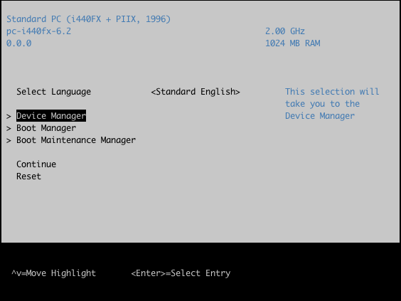
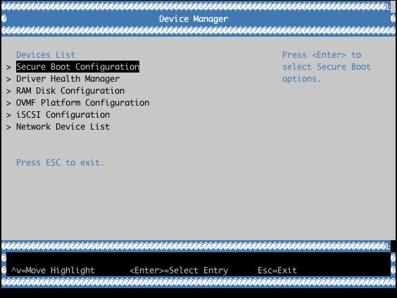
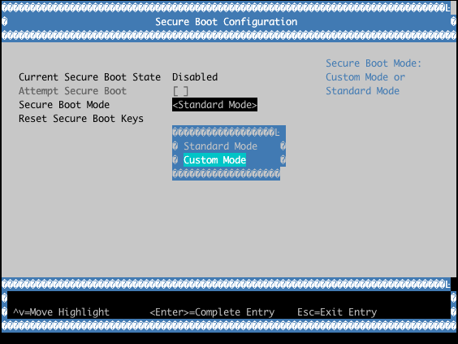
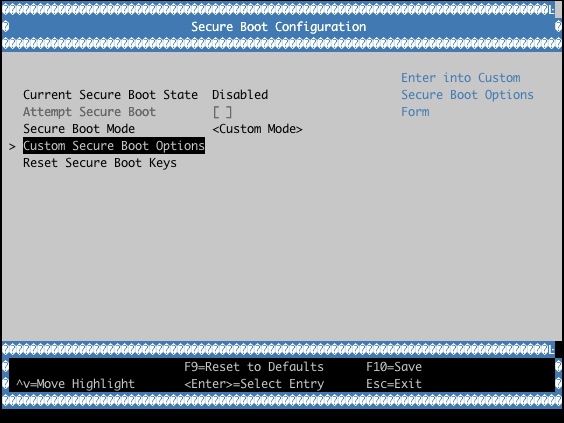
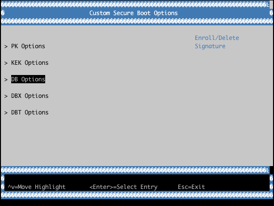
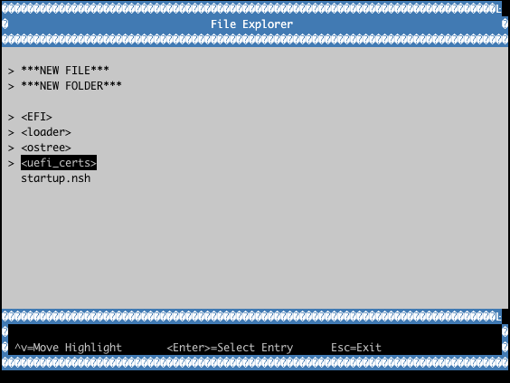
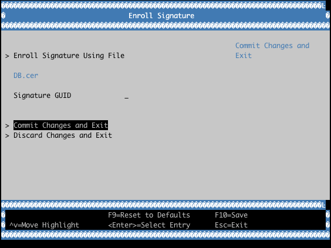
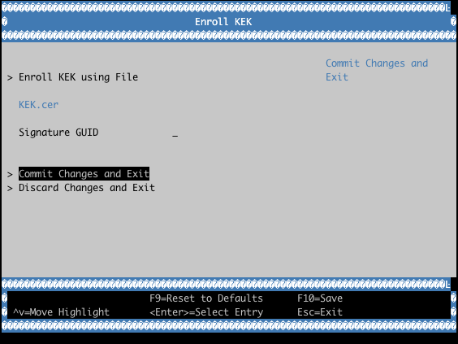
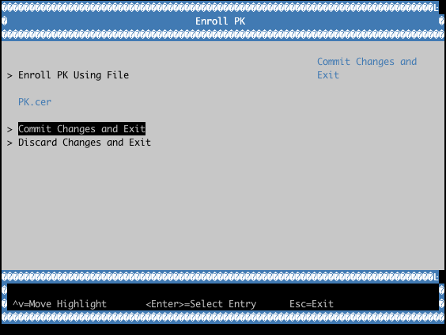
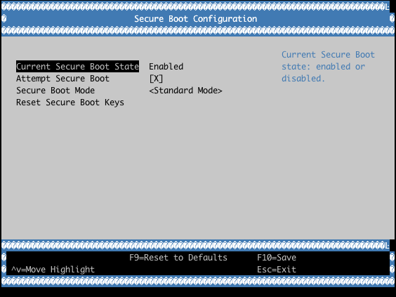

.. highlight:: sh

.. _ref-secure-boot-uefi:

Unified Extensible Firmware Interface (UEFI) Secure Boot
========================================================

Unified Extensible Firmware Interface (UEFI) Secure Boot is the industry standard defined in the UEFI specification.
It allows images loaded by the UEFI runtime to be verified via certificates corresponding to the trusted keys.

When enabled in LmP, the bootloader and kernel will be signed automatically during the build.
This implies that the signed binaries are contained in the final rootfs image.

Our Implementation
------------------

You are expected to take complete ownership of the keys and certificates required for supporting UEFI Secure Boot.
This implies owning the Platform Key (PK), Key Exchange Keys (KEKs), Allow list Database (DB), and Deny list Database (DBX).

Machine Owner Key (MOK) Secure Boot leverages a pre-bootloader shim.
Commonly used by generic Linux® distros, this is not recommended for the deployment of secure products.
As such, it is not supported.

The default UEFI-based bootloader used by LmP is `systemd-boot`_.

Keys and Roles
--------------

**Platform Key (PK)**

  Master key certificate.
  Only one PK may exist on the system as a RSA-2048 X509 certificate.
  The PK private key can sign UEFI environment variable changes, or KEK, DB, and DBX changes, that can be validated by the PK certificate.
  The PK cannot be used for signing binaries that are verified at boot time.

**Key Exchange Keys (KEKs)**

  Key normally used by system and OS vendors.
  One or more KEKs are typically available as RSA-2048 X509 certificates.
  The KEK private key can sign changes to DB and DBX.
  KEK can be used to sign bootable content; this is not recommended nor supported, as replacing KEK is nontrivial due to PK involvement.

**Allow List Database (DB)**

  Can contain SHA-256 hashes or RSA-2048 X509 certificates.
  Binaries without known hashes can be validated by a certificate.
  In LmP the DB private key is the main key used for signing both the bootloader and the kernel binaries.

**Deny List Database (DBX)**

  Can contain SHA-256 hashes or RSA-2048 X508 certificates.
  The DBX has veto power during boot time, and gets parsed first during the boot chain.
  Any binary hash matching a DBX hash, or that has a signature verified by a DBX certificate, will be prevented from executing at boot time.

Vendor Operating Modes for UEFI Secure Boot
-------------------------------------------

Different modes are available based on the UEFI Secure Boot implementation done by the vendor.
The most commonly found modes are:

**Standard Mode**

  Signature and hash checks are enforced on boot time executables.
  Microsoft KEK and DB certificates usually available.
  System vendors may include their own KEK and/or DB certificates.

**User/Custom Mode**

  Signature and hash checks are enforced on boot time executables.
  Custom Mode allows the system owner to change the contents of the Secure Boot PK, KEK, DB and DBX data stores, owning the chain of trust completely.
  This is the recommended mode to use with the LmP.

**Disabled Mode**

  Secure boot validation is disabled, and any EFI binary can be executed during boot.
  Disabled mode is the default in Legacy or Compatibility Support Module modes.

**Setup Mode**

  Option available when the system does not have a PK installed.
  Setup mode allows for PK, KEK, DB and DBX values to be manipulated by the user for claiming ownership of the Secure Boot implementation.

Once PK is added by the user, most UEFI implementations move the active mode from Setup to User/Custom at the next boot automatically.
This is the why it should be the last certificate you add.

Creating UEFI Secure Boot Keys
------------------------------

To create a custom set of UEFI Secure Boot keys and certificates, use `lmp-tools gen_uefi_certs.sh <https://github.com/foundriesio/lmp-tools/blob/master/security/uefi/gen_uefi_certs.sh>`_.

1. Clone the ``lmp-tools`` repository from GitHub

.. prompt:: bash host:~$

    git clone https://github.com/foundriesio/lmp-tools.git

2. Create the directory for storing the keys and certificates

.. prompt:: bash host:~$

    mkdir custom_uefi_keys_and_certs

3. Install the prerequisite packages to use ``gen_uefi_certs.sh``

.. prompt:: bash host:~$

    sudo apt install openssl, efitools, uuid-runtime

4. Run ``gen_uefi_certs.sh``

.. prompt:: bash host:~$

    cd custom_uefi_keys_and_certs
    ../lmp-tools/security/uefi/gen_uefi_certs.sh

The generated certificates must be enrolled into your target UEFI implementation.
The DB private key must be made available to LmP during build time for signing the required bootloader and kernel boot images.

Store the generated keys and certificates securely.

Custom keys can be added to the ``lmp-manifest`` repo directory ``factory-keys/uefi``.

Enabling UEFI Secure Boot Usage in LmP
--------------------------------------

The signing process in LmP is controlled by the following Yocto Project variables:

* ``UEFI_SIGN_KEYDIR``
    * Path for the directory containing the DB private key (``DB.key`` and ``DB.crt``),
      required certificates files (``PK.cer``, ``KEK.cer``, ``DB.cer`` and ``DBX.cer``),
      and auth files (``PK.auth``, ``KEK.auth``, ``DB.auth``, and ``DBX.auth``)
* ``UEFI_SIGN_ENABLE``
    * If set to ``1`` the systemd-boot bootloader and Linux kernel binaries will be signed by with the DB key (``DB.key`` at ``UEFI_SIGN_KEYDIR``)

Backup Current UEFI Secure Boot Certificates
--------------------------------------------

It is advisable to backup the current UEFI Secure Boot values—created and included by the UEFI firmware and hardware platform vendors—to be restored in case of errors.

.. note::

    Some vendors require hashes to be available in the user defined DB hash list in order for certain hardware resources to be available at boot time (e.g. network devices, storage controllers, etc).
    Backing up the current values is useful if they need to be restored or later added to your custom DB hash list.
    Check with your hardware platform vendor for more information.

1. Boot LmP with UEFI Secure Boot disabled
2. Dump the UEFI Secure Boot variables (EFI Signature List format)

.. prompt:: bash $

    efi-readvar -v PK -o PK.old.esl
    efi-readvar -v KEK -o KEK.old.esl
    efi-readvar -v db -o DB.old.esl
    efi-readvar -v dbx -o DBX.old.esl

The ``sig-list-to-certs`` utility (from efitools) can be used to break from ESL into hashes and certificates.

Enrolling Custom UEFI Secure Boot Certificates
----------------------------------------------

It is possible to enroll custom UEFI Secure Boot Certificates using your firmware's built-in setup utility, ``KeyTool`` (from ``efitools``).
You could also create a custom ``LockDown`` efi program with the certificates embedded into it.

By default, LmP installs the required certificates (via ``UEFI_SIGN_KEYDIR``) into the ESP image partition (under ``ESP/uefi_certs``).
This can be used when enrolling via the firmware's built-in setup utility.
When automating the enrollment process, using ``LockDown`` is the recommended path.

Example with **QEMU OVMF**:

Verifying the UEFI Secure Boot State
----------------------------------------

To check if UEFI Secure Boot is enabled and used at runtime, execute the ``bootctl`` tool:

.. prompt::

	root@intel-corei7-64:~# bootctl
	System:
		 Firmware: UEFI 2.70 (EDK II 1.00)
	  Secure Boot: enabled (user)
	 TPM2 Support: no
	 Boot into FW: supported

	Current Boot Loader:
		  Product: systemd-boot 250.4-1-gc3aead5
		 Features: ✓ Boot counting
				   ✓ Menu timeout control
				   ✓ One-shot menu timeout control
				   ✓ Default entry control
				   ✓ One-shot entry control
				   ✓ Support for XBOOTLDR partition
				   ✓ Support for passing random seed to OS
				   ✓ Load drop-in drivers
				   ✓ Boot loader sets ESP information
			  ESP: /dev/disk/by-partuuid/e7a6486b-3059-4703-84bd-d082b4971172
			 File: └─/EFI/BOOT/BOOTX64.EFI

	Random Seed:
	 Passed to OS: no
	 System Token: not set
		   Exists: no

	Available Boot Loaders on ESP:
			  ESP: /boot (/dev/disk/by-partuuid/e7a6486b-3059-4703-84bd-d082b4971172)
			 File: └─/EFI/systemd/systemd-bootx64.efi (systemd-boot 250.4-1-gc3aead5)
			 File: └─/EFI/BOOT/bootx64.efi (systemd-boot 250.4-1-gc3aead5)

	Boot Loaders Listed in EFI Variables:
	Boot Loader Entries:
			$BOOT: /boot (/dev/disk/by-partuuid/e7a6486b-3059-4703-84bd-d082b4971172)

	Default Boot Loader Entry:
			title: Linux-microPlatform 4.0.1 (ostree:0)
			   id: ostree-1-lmp.conf
		   source: /boot/loader/entries/ostree-1-lmp.conf
		  version: 1
			linux: /ostree/lmp-26db6d4337dc3f7644135bc0d6bd1d386f9535ecc8497be68be9a798e002ebba/vmlinuz-5.15.45-lmp-standard
		   initrd: /ostree/lmp-26db6d4337dc3f7644135bc0d6bd1d386f9535ecc8497be68be9a798e002ebba/initramfs-5.15.45-lmp-standard.img
		  options: console=ttyS0,115200 root=LABEL=otaroot rootfstype=ext4 ostree=/ostree/boot.1/lmp/26db6d4337dc3f7644135bc0d6bd1d386f9535ecc8497be68be9a798e002ebba/0

Another quick method is to check for the **Secure boot** kernel boot log message:

.. prompt::

	root@intel-corei7-64:~# dmesg | grep "Secure boot"
	[    0.002984] Secure boot enabled

Additional Documentation and References
---------------------------------------

* `Managing EFI Boot Loaders for Linux: Controlling Secure Boot <https://www.rodsbooks.com/efi-bootloaders/controlling-sb.html>`_
* `Understanding UEFI Secure Boot Chain <https://edk2-docs.gitbook.io/understanding-the-uefi-secure-boot-chain/>`_
* `NSA UEFI Lockdown Quick Guidance <https://www.nsa.gov/portals/75/documents/what-we-do/cybersecurity/professional-resources/csi-uefi-lockdown.pdf>`_
* `NSA UEFI Secure Boot Customization <https://media.defense.gov/2020/Sep/15/2002497594/-1/-1/0/CTR-UEFI-Secure-Boot-Customization-UOO168873-20.PDF>`_

.. _systemd-boot:
   https://www.freedesktop.org/wiki/Software/systemd/systemd-boot/
